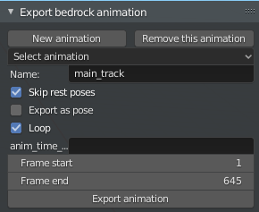

# Panels
## Custom properties panel

This panel adds easy acces for managing some of the custom properties used by
the plugin.

__Usage__

- **Toggles mc_mirror** - Toggles `mc_mirror` property for selected object.
  Objects that has `mc_mirror` property create cubes with mirrored uv.
- **Set mc_uv_group** - Groups selected object together which affects the
  UV-mapping. Object asigned to the same `mc_uv_group` are mapped to the same
  spot on the texture if they have the same dimensions.
- **Toggle mc_is_bone** - Toggles `mc_is_bone` property for selected objects.
  object whit this property are exported as bones in Minecraft model.
- **Set mc_inflate** - Set the `mc_inflate` vale for selected objects. This is
  equivalent to setting the inflate value in Minecraft model.

## Set bedrock UVs panel

This panel is used for creating UV-mapping for the model and generating
template textures.

__Usage__

By default all of the cubes in the model have the [0, 0] uv-mapping.
The uv mapping vlaues of each object are stored in `mc_uv` custom property.

To perform the uv-mapping set the values in the form and press "Set minecraft
UVs"

- **Texture width** - the texture width property of the Minecraft model.
- **Texture height** - the texture height property of the Minecraft model.
  If you sent this property to 0 the texture height will be selected
  automatically to fit all textures as tight as possible.
- **Move existing mcUv mappings** - this chceckbox decides if the cubes that
  already have assigned uv-mapping values can be moved.
- **Move blender UV mappings** - this checkbox decides if blender objects
  should have their UV-mapping moved to match the minecraft model.
- **Remove old UV maps** - objects in blender can have multiple UV mpas but
  only one of them is visible. Ticking this box causes that old uv-maps are
  removed when the new one is created.
- **Template resolution** - Sets the resolution of the template texture. If you
  set this to 0 than the template texture won't be created. This value
  describes how many pixels on the image is represented by one texture_widht or
  texture_height unit in model definition. The value 1 gives the standard
  Minecraft texture resolution. Higher values can be used to create "HD"
  textures.
- **Set minecraft UVs** button runs the operator which plans the UV-mapping and
  optionally creates the template texture.

## Export bedrock model panel

This panel is used for exporting the models.

__Usage__

1. Set the model to its neutral pose. Use frame 0 (frame before
  the animation starts) and add a keyframe with neutral model position to it.
2. Select all of the objects that you want to export.
3. Insert the name of the model.
4. Press the "Export model" button.

## Export bedrock animation panel

This panel is used for exporting animations.

__Usage__

1. Select all of the objects to export.
3. Insert the name of the animation.
4. If you want loop the animation select the "loop" checkbox.
5. If you want to use the `anim_time_update` property of minecraft animation
  insert its value to a proper textfield. You can leave it blank if you don't
  want to use it.
6. Press "Export animation" button.
